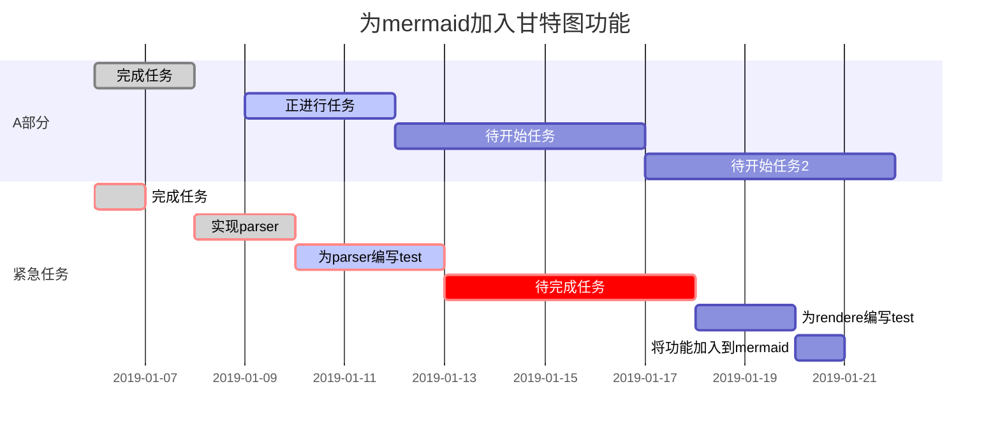

# 1. Markdown教程

- Markdown 是一种轻量级标记语言，它允许人们使用易读易写的纯文本格式编写文档。
- Markdown 语言在 2004 由约翰·格鲁伯（英语：John Gruber）创建。
- Markdown 编写的文档可以导出 HTML 、Word、图像、PDF、Epub 等多种格式的文档。
- Markdown 编写的文档后缀为 .md, .markdown。

| 功能     |  快捷键  |
| -------- | :------: |
| 加粗     | Ctrl + B |
| 斜体     | Ctrl + I |
| 引用     | Ctrl + Q |
| 插入链接 | Ctrl + L |
| 插入代码 | Ctrl + K |
| 插入图片 | Ctrl + G |
| 提升标题 | Ctrl + H |
| 有序列表 | Ctrl + O |
| 无序列表 | Ctrl + U |
| 横线     | Ctrl + R |
| 撤销     | Ctrl + Z |
| 重做     | Ctrl + Y |


# 2. 基本语法

## 2.1. 字体设置斜体、粗体、删除线
*斜体*
_斜体_
**粗体**
***斜+粗体***
~~删除线~~
## 2.2. 标题

**写法一**
```
# 一级标题
# 二级标题
## 三级标题
### 四级标题
```
**写法二**
```
一级标题
==================
二级标题
------------------
```
## 2.3. 链接


www.baidu.com

## 2.4. 分割线

---
***
___

## 2.5. 代码块

- 4个空格或1个制表符
- 行内式，使用反引号
行内式示例`hello`
- 三个`
- 代码块中使用html代码

## 2.6. 引用

- 基本引用
> base
> base
- 嵌套引用
> first level
>> second level
> base
- 引用其他要素
> base
> - hello
> - hello
> - hello

## 2.7. 列表

**无序列表**
- 列表写法一
- 列表写法一
* 列表写法二
* 列表写法二
+ 列表写法三
+ 列表写法三

**有序列表**
1. 有序列表
2. 有序列表
3. 有序列表
4. 有序列表

*注意事项*
使用列表时，数字加.就会无意间产生列表，避免使用反斜线

## 2.8. 表格

| 功能 |  快捷键  |
| ---- | :------: |
| 加粗 | Ctrl + B |

# 3. 常用技巧

## 3.1. 换行

方法一：连续两个以上空格+回车
方法二：使用html语言换行标签
## 3.2. 缩进字符
不断行的空白格、半角的空格、全角的空格
## 3.3. 特殊字符
- 使用反斜线进行表示
\*  \. \!
- 其他特殊字符，Unicode码
&#10084;
想知道字符对应的Unicode码，可以看这个网站：https://unicode-table.com/cn/

## 3.4. 字体、字号、颜色
<font face="黑体" size=15 color=red>字体样式测试</font>

## 3.5. 链接技巧
<span id="index">index</span>

<font face="黑体" size=15 color=red>目录</font>
[TOC]

<font face="黑体" size=15 color=red>锚点</font>
跳转到[链接技巧](#index)

注脚
使用markdown[^1]可以高效书写文档
[^1]:Markdown是一种纯文本标记语言。

## 3.6. 背景颜色
markdown本身不支持背景色设置，但可采用内置html方式实现
<table><tr><td bgcolor=orange>背景色是：orange</td></tr></table>

## 3.7. emoji表情符号
:smile:
:smirk:

# 4. 高端用法
## 4.1. Latex数学公式
### 4.1.1. 如何插入公式
- 行内公式，将公式插入到本行内，$x+y=z$
- 独行公式，将公式插入到新的一行内，并且居中。
  $$x+y=z$$

### 4.1.2. 上标、下标、组合、特殊格式、占位符
| 符号名   | 格式                         | 示例                                           |
| :------- | :--------------------------- | :--------------------------------------------- |
| 上标     | ^                            | $x^2$                                          |
| 下标     | _                            | $x_2$                                          |
| 组合     | {}                           | $x_{12}$                                       |
| 空格     | \quad                        | $x \quad y$                                    |
| 下划线   | \underline                   | $\underline{x+y}$                              |
| 标签     | \tag                         | $\displaystyle \tag{}$                         |
| 括号     | (),\big(x\big)               | $(x),\big(x\big),\Big(x\Big)$                  |
| 上大括号 | \overbrace                   | $\overbrace{a+b+c+d}^{字母}$                   |
| 下大括号 | \underbrace                  | $a+\underbrace{b+c+d}_{1.0}+e$                 |
| 上位符号 | \stacrel{上位符号}{基位符号} | $x\stackrel{\mathrm{def}}{=}{x_1, \dots, x_n}$ |

### 4.1.3. 四则运算
| 符号名 | 格式   | 示例          |
| :----- | :----- | :------------ |
| 加减   | \pm    | $x \pm y$     |
| 减加   | \mp    | $x \mp y$     |
| 乘法   | \times | $x \times y$  |
| 星乘   | \ast   | $x \ast y$    |
| 点乘   | \cdot  | $x \cdot y$   |
| 除法   | \div   | $x \div y$    |
| 斜除   | /      | $x/y$         |
| 分式   | \frac  | $\frac{x}{y}$ |
| 分式   | \over  | $x \over y$   |

### 4.1.4. 高级运算
| 符号名   | 格式                                            | 示例                                                      |
| :------- | :---------------------------------------------- | :-------------------------------------------------------- |
| 平均数   | \overline{...}                                  | $\overline{x_1,x_2,\cdots,x_n}$                           |
| 开二次方 | \sqrt                                           | $\sqrt{x+y}$                                              |
| 开方     | \sqrt                                           | $\sqrt(3){x+y}$                                           |
| 对数     | \log{}                                          | $\log{x}$                                                 |
| 极限     | \lim{}                                          | $\lim^{x \to \infty}_{y \to 0}{\frac{x}{y}}$              |
| 极限     | \displaystyle\lim{}                             | $\displaystyle\lim^{x \to \infty}_{y \to 0}{\frac{x}{y}}$ |
| 求和     | \sum{}                                          | $\sum^{x \to \infty}_{y \to 0}{\frac{x}{y}}$              |
| 求和     | \displaystyle\sum{}                             | $\displaystyle\sum^{x \to \infty}_{y \to 0}{\frac{x}{y}}$ |
| 积分     | \int{}                                          | $\int^{\infty}_{0}{xnx}$                                  |
| 积分     | \displaystyle\int{}                             | $\displaystyle\int^{\infty}_{0}{xnx}$                     |
| 微分     | \partial{}                                      | $\frac{\partial x}{\partial y}$                           |
|          | ${n+1 \choose k}={n \choose k}+{n \choose k-1}$ |
|          | ${n+1 \choose k}={n \choose k}+{n \choose k-1}$ |

### 4.1.5. 矩阵
`$$\begin{matrix}...\end{matrix}`，使用&分隔同行元素，\换行
$$\begin{matrix}
    1 & x & x^2 \\
    1 & x & x^2 \\
    1 & x & x^2
\end{matrix}$$

### 4.1.6. 逻辑运算符

| 符号名   | 格式    | 示例            |
| :------- | :------ | :-------------- |
| 大于等于 | \geq    | $x+y \geq z$    |
| 小于等于 | \leq    | $x+y \leq z$    |
| 约等于   | \approx | $x+y \approx z$ |
| 恒等于   | \equiv  | $x+y \equiv z$  |


### 4.1.7. 集合运算符
| 符号名   | 格式        | 示例              |
| :------- | :---------- | :---------------- |
| 属于     | \in         | $x \in y$         |
| 不属于   | \notin      | $x \notin y$      |
| 子集     | \subset     | $x \subset y$     |
| 子集     | \supset     | $x \supset y$     |
| 真子集   | \supseteq   | $x \supset y$     |
| 非真子集 | \subsetneq  | $x \subsetneq y$  |
| 非子集   | \not\subset | $x \not\subset y$ |
| 非子集   | \not\supset | $x \not\supset y$ |
| 并集     | \cup        | $x \cup y$        |
| 交集     | \cap        | $x \cap y$        |
| 差集     | \setminus   | $x \setminus y$   |
| 同或     | \bigodot    | $x \bigodot y$    |
| 同与     | \bigotimes  | $x \bigotimes y$  |
| 实数     | \mathbb{R}  | $\mathbb{R}$      |
| 自然数   | \mathbb{Z}  | $\mathbb{Z}$      |
| 空集     | \emptyset   | $\emptyset$       |

### 4.1.8. 数学符号
| 符号名         | 格式                   | 示例                     |
| :------------- | :--------------------- | :----------------------- |
| 无穷           | \infty                 | $\infty$                 |
| 虚数           | \imath                 | $\imath$                 |
| 虚数           | \jmath                 | $\jmath$                 |
| 数学符号       | \hat{a}                | $\hat{a}$                |
| 数学符号       | \check{a}              | $\check{a}$              |
| 数学符号       | \breve{a}              | $\breve{a}$              |
| 数学符号       | \tilde{a}              | $\tilde{a}$              |
| 数学符号       | \bar{a}                | $\bar{a}$                |
| 数学符号       | \acute{a}              | $\acute{a}$              |
| 数学符号       | \grave{a}              | $\grave{a}$              |
| 数学符号       | \mathring{a}           | $\mathring{a}$           |
| 矢量符号       | \vec{a}                | $\vec{a}$                |
| 一阶导数符号   | \dot{a}                | $\dot{a}$                |
| 二阶导数符号   | \ddot{a}               | $\ddot{a}$               |
| 上箭头         | \uparrow\Uparrow       | $\uparrow\Uparrow$       |
| 下箭头         | \downarrow\Downarrow   | $\downarrow\Downarrow$   |
| 左箭头         | \leftarrow\Leftarrow   | $\leftarrow\Leftarrow$   |
| 右箭头         | \rightarrow\Rightarrow | $\rightarrow\Rightarrow$ |
| 底端对齐省略号 | \ldots                 | $1,2, \ldots ,n$         |
| 中线对齐省略号 | \cdots                 | $1,2, \cdots ,n$         |
| 竖直对齐省略号 | \vdots                 | $1,2, \vdots ,n$         |
| 斜对齐省略号   | \ddots                 | $1,2, \ddots ,n$         |


### 4.1.9. 罗马符号
| 格式     | 表示       | 格式     | 表示       |
| :------- | :--------- | :------- | :--------- |
| A        | $A$        | \alpha   | $\alpha$   |
| B        | $B$        | \beta    | $\beta$    |
| \Gamma   | $\Gamma$   | \gamma   | $\gamma$   |
| \Delta   | $\Delta$   | \delta   | $\delta$   |
| E        | $E$        | \epsilon | $\epsilon$ |
| Z        | $Z$        | \zeta    | $\zeta$    |
| H        | $H$        | \eta     | $\eta$     |
| \Theta   | $\Theta$   | \theta   | $\theta$   |
| I        | $I$        | \iota    | $\iota$    |
| K        | $K$        | \kappa   | $\kappa$   |
| \Lambda  | $\Lambda$  | \lambda  | $\lambda$  |
| M        | $M$        | \mu      | $\mu$      |
| N        | $N$        | \nu      | $\nu$      |
| \Xi      | $\Xi$      | \xi      | $\xi$      |
| O        | $O$        | \omicron | $\omicron$ |
| \Pi      | $\Pi$      | \pi      | $\pi$      |
| P        | $P$        | \rho     | $\rho$     |
| \Sigma   | $\Sigma$   | \sigma   | $\sigma$   |
| T        | $T$        | \tau     | $\tau$     |
| \Upsilon | $\Upsilon$ | \upsilon | $\upsilon$ |
| Phi      | $Phi$      | \phi     | $\phi$     |
| X        | $X$        | \chi     | $\chi$     |
| \Psi     | $\Psi$     | \psi     | $\psi$     |
| \Omega   | $\Omega$   | \omega   | $\omega$   |


## 4.2. 流程图
### 4.2.1. 语法结构
`X=>Y: Z` 其中X是变量名，Y是指操作模块名，Z是具体显示文字内容。注意冒号后面需要有空格。
X和Z变量名可随意设置，但Y有固定格式：
| 标识        | 说明       |
| :---------- | :--------- |
| start       | 开始       |
| end         | 结束       |
| operation   | 普通操作块 |
| subroutine  | 子任务块   |
| condition   | 判断块     |
| inputoutput | 输入输出块 |

### 4.2.2. 转向控制
- 1）`->` 表示下一步要执行的操作。可以连续写，如：st->in->op->cond。也可以分开，如：st->in, in->op
- 2）condition是判断，可取yes和no两种结果，不同结果可以有不同走向。如：cond(yes)->out, cond(no)->op

### 4.2.3. 示例
```flow
st=>start: 开始
in=>inputoutput: 输入值
e=>end: 结束
op=>operation: 执行操作
cond=>condition: 是否成立？
out=>inputoutput: 输出值

st->in->op->cond
cond(yes)->out
cond(no)->op
out->e
```

## 4.3. 甘特图




## 4.4. TODO列表
- [] 列表1
- [] 列表1
- [x] 列表1
- [] 列表1