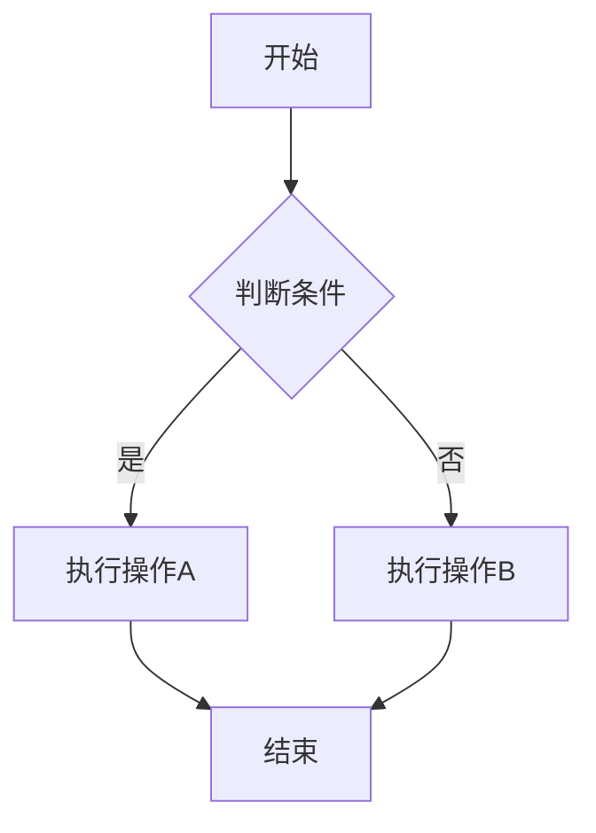
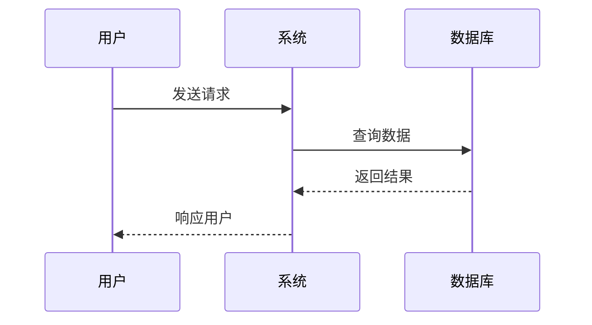
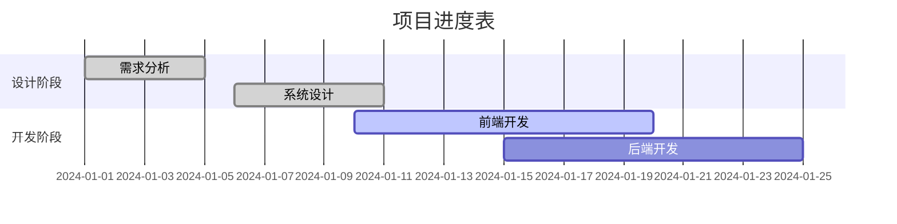
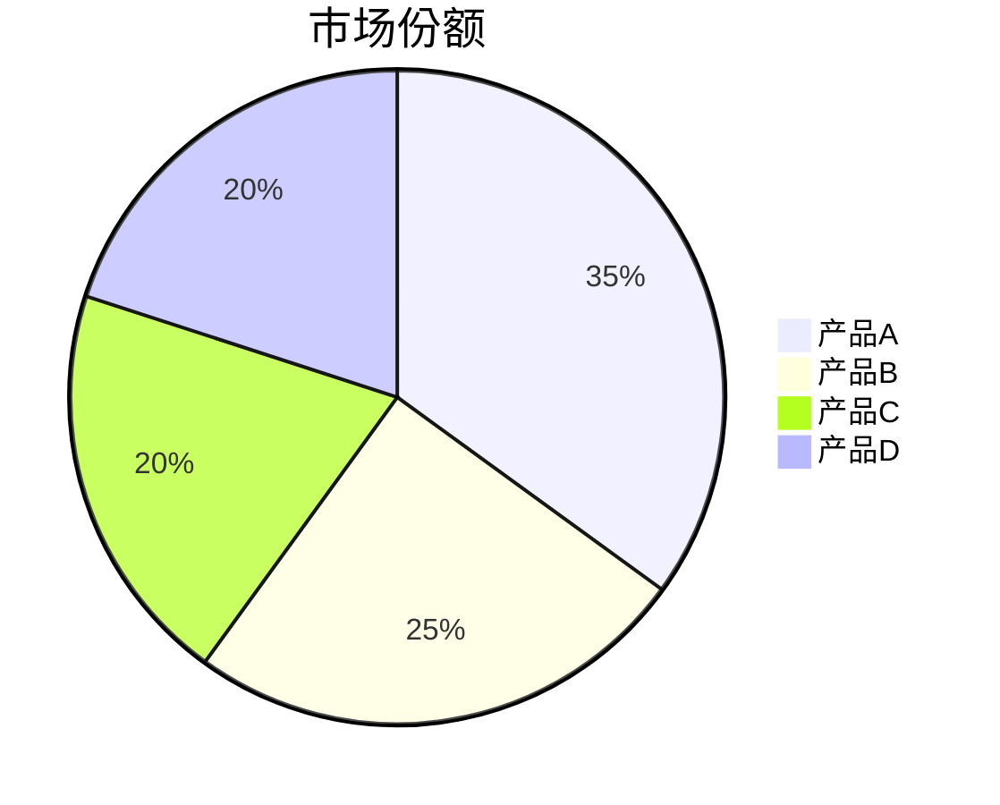

# 软件设计图 (Software Design Diagrams)

本文件整合了软件设计中常用的各种图表类型，包括UML图和其他重要的设计图。这些图表帮助我们更好地理解和表达软件系统的结构和行为。

## 目录
1. [UML总体概述](#uml总体概述)
2. [类图 (Class Diagram)](#类图-class-diagram)
3. [时序图 (Sequence Diagram)](#时序图-sequence-diagram)
4. [状态图 (State Diagram)](#状态图-state-diagram)
5. [流程图 (Flow Diagram)](#流程图-flow-diagram)
6. [泳道图 (Swimlane Diagram)](#泳道图-swimlane-diagram)

## UML总体概述

UML（统一建模语言）是一种标准化的建模语言，用于可视化、规范、构建和记录软件系统的各个方面。

### UML图分类
1. 结构图
   - 类图
   - 对象图
   - 组件图
   - 部署图
   - 包图
   - 组合结构图

2. 行为图
   - 用例图
   - 活动图
   - 状态图
   - 时序图
   - 通信图
   - 交互概览图

### UML建模工具
- Enterprise Architect
- Visual Paradigm
- StarUML
- Lucidchart
- Draw.io

## 类图 (Class Diagram)

类图是UML中最常用的图之一，用于描述系统中的类及其之间的关系。

### 类图元素
1. 类
   - 类名
   - 属性
   - 方法

2. 关系
   - 继承关系
   - 实现关系
   - 关联关系
   - 聚合关系
   - 组合关系
   - 依赖关系

### 类图示例
```mermaid
[类名]
+属性1: 类型
+属性2: 类型
+方法1(): 返回类型
+方法2(): 返回类型
```

## 时序图 (Sequence Diagram)

时序图展示了对象之间交互的顺序，强调消息的时间顺序。

### 时序图元素
1. 对象
2. 生命线
3. 消息
   - 同步消息
   - 异步消息
   - 返回消息
4. 激活期
5. 组合片段

### 时序图示例
```
对象A    对象B    对象C
  |        |        |
  |--请求-->|        |
  |        |--请求-->|
  |        |<--响应--|
  |<--响应--|        |
```

## 状态图 (State Diagram)

状态图描述了对象在其生命周期内所经历的状态序列，以及对这些事件的响应。

### 状态图元素
1. 状态
2. 转换
3. 事件
4. 动作
5. 条件

### 状态图示例
```
[初始状态] --> [状态1]
[状态1] --> [状态2]: 事件1
[状态2] --> [状态3]: 事件2
[状态3] --> [终止状态]
```

## 流程图 (Flow Diagram)

流程图用于描述算法或业务流程的执行过程。

### 流程图元素
1. 开始/结束
2. 处理步骤
3. 判断
4. 输入/输出
5. 连接线

### 流程图示例
```mermaid
开始
  |
  v
[处理1]
  |
  v
{判断}
  |
  v
[处理2]
  |
  v
结束
```

## 泳道图 (Swimlane Diagram)

泳道图是一种特殊的流程图，用于展示不同角色或部门之间的交互。

### 泳道图元素
1. 泳道
2. 活动
3. 决策点
4. 连接线
5. 开始/结束

### 泳道图示例
```m
角色A    角色B    角色C
  |        |        |
[活动1]    |        |
  |        |        |
  |------->|        |
  |      [活动2]    |
  |        |        |
  |        |------->|
  |        |      [活动3]
  |        |        |
  |<----------------|
[活动4]    |        |
  |        |        |
```

## 设计图最佳实践

1. 保持简洁
   - 避免过度复杂
   - 关注重要细节
   - 使用适当的抽象级别

2. 保持一致性
   - 使用统一的符号
   - 遵循命名规范
   - 保持风格一致

3. 注重可读性
   - 合理布局
   - 适当注释
   - 清晰的层次结构

4. 及时更新
   - 反映最新设计
   - 保持文档同步
   - 版本控制

5. 工具选择
   - 选择合适的工具
   - 考虑团队协作
   - 支持版本控制 


   # Mermaid 图表测试

## 流程图测试



## 时序图测试



## 甘特图测试



## 饼图测试

